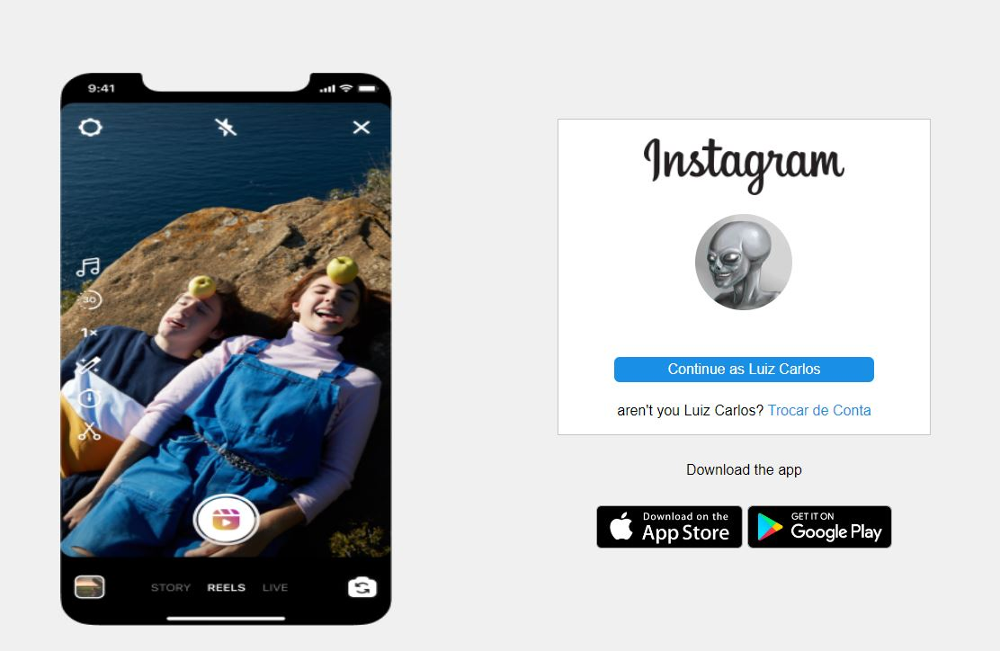

Template Login Instagram

 
 

Responsive Instagram Login

 
 

### Required:

* [HTML Basic](https://www.w3schools.com/html/)
* [CSS Basic](https://developer.mozilla.org/pt-BR/docs/Web/CSS)

## 🚀 Let's code! 🚀
